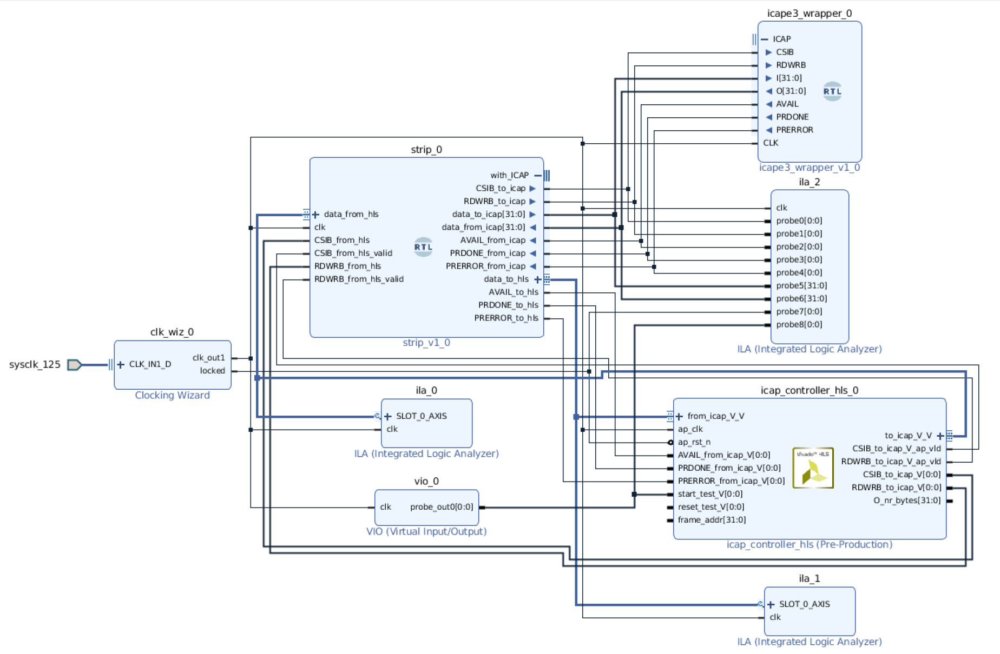

# HLS-based Xilinx ICAP Controller

This repo is an HLS-based [ICAPE3]((https://www.xilinx.com/support/documentation/user_guides/ug570-ultrascale-configuration.pdf)) controller,
which is able to *read ICAPE3 registers*
and perform *bitstream readback*.
However, there is no write functions.

Why HLS? Because I could not write too much Verilog.
Do not get me wrong, writing HLS is not easy either.
It turns out it's much harder than writing Verilog alone,
because I kind of need to control the cycles precisely in HLS using state machines.

The ICAPE3
primitive itself is a macro that only accessible within Vivado.
Thus I added some glue code to connect the HLS controller with the ICAPE3 primitive.
The result is the block design, which is our main part.

If you want to know more about bitstream,
I have a [blog about that](http://lastweek.io/fpga/bitstream/).

## Thoughts
If you are reading, you are probably interested in ICAPE3, which means you are interested
in bitstream readback or partial reconfiguration. I started because I want to do both.

At first, I was looking into the official Xilinx Partial Reconfiguration Controller,
but I thought it was too complex. So I started developing my own using raw ICAPE3.
This repo actually is similar to AXI HWICAP, which I was not aware in the beginning.
Either way, you still need to write an extra layer to control AXI HWICAP.

During the development, I found it extremely difficult to be able do write, i.e.,
partial reconfiguration. Another reason is that I'm afraid I would do harm to the chip.

Thus I turned to my final solution: using MicroBlaze. It turns out, this is the easiest
and fastest prototype solution. Within one day, I had a C++ prototype that is able to
perform bitstream readback and partial reconfiguration. I was thrilled, because
I was eager to see the effect of that.

However, I didn't tune the performance of the MicroBlaze-based solution.
My first one performs bad because data was sent from the PC over serial line.
It should be faster to use on-board DRAM.

Anyway, my suggestion is: if you just want to have a fast prototype, I would
suggest you start from MicroBlaze C++ solution, get some understanding of ICAPE3 behavior and its safer.
Later on, if the performance is not satisfying (not sure about that), turn to HLS or Verilog
based solution to control ICAPE3 directly.

There are a lot ICAPE3 academic papers out there, but no high-quality
open source projects. This repo is not either. :)

## Details

HLS Part:
I have created 3 main functions to interact with ICAPE3.
Each of them is a sequence of steps consisting of multiple ICAPE3 instructions.
Each function has an associated command array that describes precise steps.

The code is a bit tricky. Happy hacking!

`cmd_iprog()`: Reprogram the chip.
```c
static int cmd_iprog(stream<ap_uint<ICAP_DATA_WIDTH> > *from_icap,    
                     stream<ap_uint<ICAP_DATA_WIDTH> > *to_icap,    
                     volatile ap_uint<1> *CSIB_to_icap,    
                     volatile ap_uint<1> *RDWRB_to_icap)
```

`cmd_read_regs()`: You can pass an register number to read.
```c
int cmd_read_regs(stream<ap_uint<ICAP_DATA_WIDTH> > *from_icap,    
                  stream<ap_uint<ICAP_DATA_WIDTH> > *to_icap,    
                  volatile ap_uint<1> *CSIB_to_icap,    
                  volatile ap_uint<1> *RDWRB_to_icap,    
                  int reg_nr, int *reg_data)
```

`cmd_read_bitstreams()`: You can pass an frame address and bytes to read.
```c
int cmd_read_bitstreams(stream<ap_uint<ICAP_DATA_WIDTH> > *from_icap,
                        stream<ap_uint<ICAP_DATA_WIDTH> > *to_icap,
                        volatile ap_uint<1> *CSIB_to_icap,
                        volatile ap_uint<1> *RDWRB_to_icap,
                        volatile int *O_nr_bytes,
                        volatile int *frame_addr)
```

Vivado Part:
I created a simple strip modoule that is sitting in the middle
of HLS controller and ICAPE3 primitive. The strip module
will rip off some extra signals produced by HLS,
and ensure the signal in and out are correct.

The while design is described by the following block design:


## Run

Directories:

- `icap_controller`: The HLS code
- `ip`: the final Vivado script
- `include`: marcos about ICAPE3

This code is built for `VCU118`, an Ultrascale+ chip.
I believe you can port to any other Ultrascale or Ultrscale+ chip easily.
The code has been tested with `Vivado 2018.3/2019.1`.

To run, simply use `make`. And you can do so under each directories.